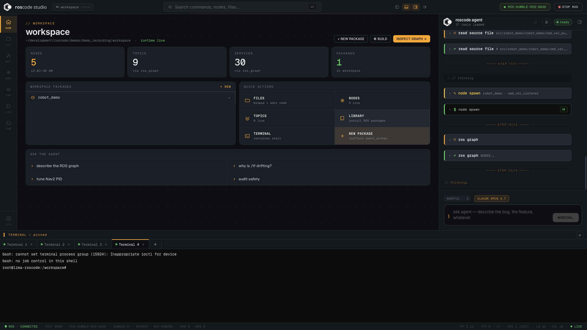
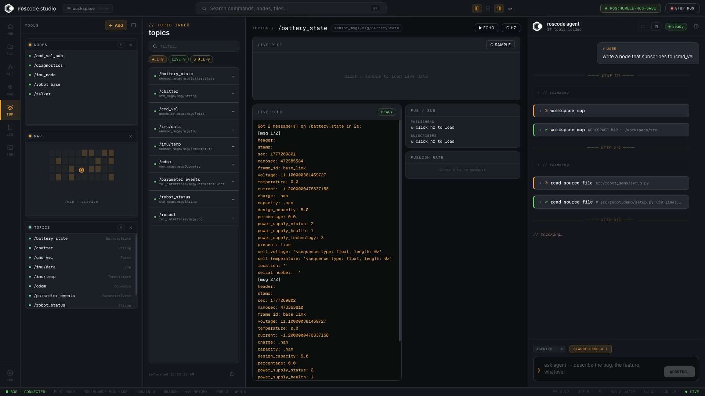
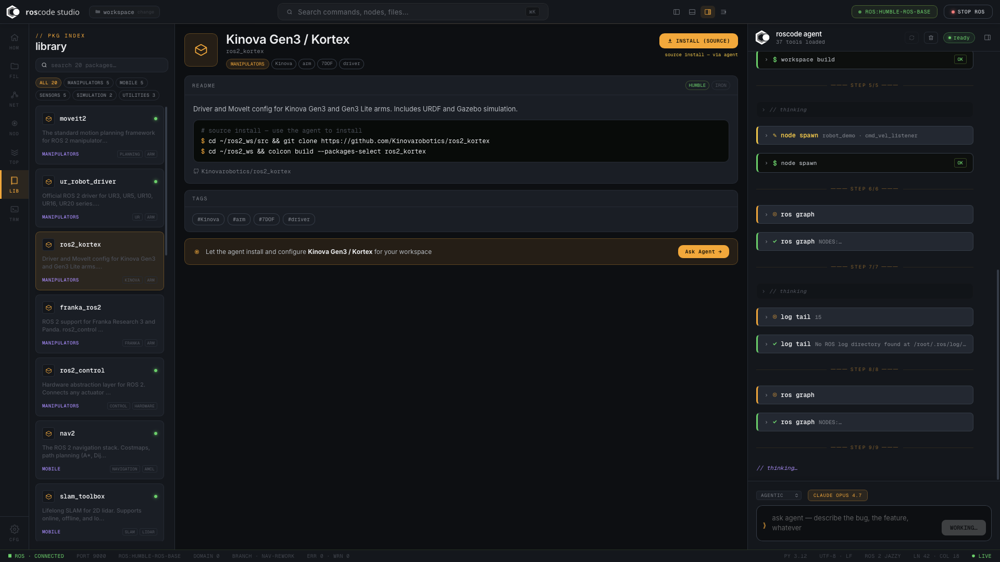
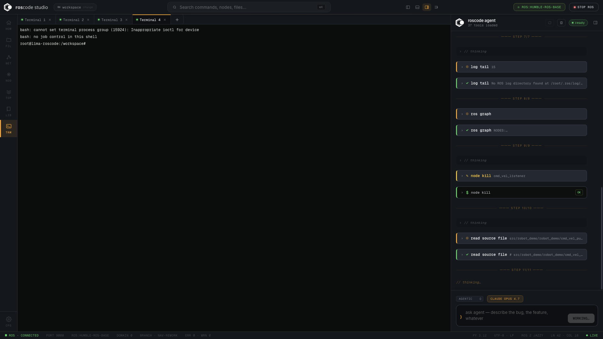

# roscode studio

> AI-native desktop IDE for ROS 2 — one `.dmg`, zero setup.

[](../releases/)
[](https://docs.ros.org/en/humble/)
[](https://anthropic.com)
[](https://tauri.app)

**No Docker. No ROS install. No Python setup.**  
Download the `.dmg`, open, and your robot stack is live in under a minute.

---

## Screenshots

| Workspace dashboard | Live topic echo + agent |
|---|---|
|  |  |

| Package library | Multi-terminal + agent steps |
|---|---|
|  |  |

---

## Install

### Option A — Download the DMG (recommended)

1. Download [`roscode studio_0.1.0_aarch64.dmg`](../releases/roscode%20studio_0.1.0_aarch64.dmg)
2. Open the `.dmg` and drag **roscode studio** to `/Applications`
3. First launch — macOS will block it (unsigned). Run once in Terminal:
   ```bash
   xattr -cr "/Applications/roscode studio.app"
   open "/Applications/roscode studio.app"
   ```
4. On first boot the app downloads the ROS 2 container (~500 MB). Subsequent launches are instant.

> **Requirements:** macOS 13+, Apple Silicon (M1/M2/M3/M4), ~2 GB free disk space.

### Option B — Build from source

```bash
# Prerequisites
brew install lima pnpm

# Clone
git clone -b studio https://github.com/raguirref/roscode.git
cd roscode/studio

# Install frontend deps
pnpm install

# Dev window with hot-reload
pnpm tauri dev

# Or build a release DMG
pnpm tauri build
```

---

## First steps

1. **Set your API key** — Settings → API Key → paste your `sk-ant-...` key
2. **Open a workspace** — Settings → Workspace → point to a ROS 2 workspace folder
3. **Start the runtime** — click **Start Runtime** in the top bar; the Lima VM + ROS container boot
4. **Ask the agent** — type anything in the chat panel, e.g. *"describe the ROS graph"* or *"why is the robot drifting?"*

---

## What's inside

```
┌─ roscode studio (Tauri 2 native window) ────────────────────────────┐
│                                                                       │
│  Svelte + TypeScript webview                                          │
│    ├─ Workspace home  — live node/topic/service counters + quick nav  │
│    ├─ Monaco editor   — read/write files inside the ROS container     │
│    ├─ Agent chat      — Claude Opus 4.7 · 37 ROS-aware tools          │
│    ├─ File explorer   — live container FS (create/rename/delete)      │
│    ├─ Nodes page      — node graph · pub/sub/service inspector        │
│    ├─ Topics page     — topic list · live echo · type browser         │
│    ├─ Terminal        — full pty shell inside the container           │
│    └─ Package library — curated ROS 2 package registry               │
│                              ▲  Tauri IPC  ▼                          │
│  Rust backend                                                         │
│    ├─ lima.rs         → Lima VM lifecycle                             │
│    ├─ container.rs    → nerdctl pull / run / exec / bootstrap         │
│    └─ commands.rs     → ~25 Tauri command handlers                    │
│                              ▲             ▼                          │
│  Lima VM  (Ubuntu 22.04 · rootless containerd)                        │
│    └─ ros:humble-ros-base                                             │
│        ├─ /workspace           ← bind-mounted from host               │
│        ├─ /opt/roscode-src     ← Python agent (editable install)      │
│        └─ roscode.server :9000 ← forwarded to host by Lima           │
└───────────────────────────────────────────────────────────────────────┘
```

---

## Features

### Claude-powered ROS agent
- **37 tools** — `ros_graph`, `topic_echo`, `workspace_build`, `node_spawn`, `ros_launch`, `write_source_file`, `package_scaffold`, and more
- **Agentic mode** — auto-approves all confirmations, shows a diff summary at the end
- **Plan mode** — step-by-step plan output, no execution
- **Chat mode** — conversational only, no tool calls
- Collapsible tool-call chips with live argument previews and result snippets
- Confirmation gate for destructive operations (write, build, spawn, kill)
- After `colcon build`, newly built packages are found automatically on the next `ros_launch` / `node_spawn`

### Monaco editor
- Syntax highlighting for Python, C++, XML, YAML, JSON
- Breadcrumb navigation — click any path segment to browse the container filesystem
- Direct read/write to `/workspace` inside the container

### File explorer
- Live container filesystem tree
- Right-click context menu: new file, new folder, rename, delete
- Auto-reveals and scrolls to the currently open file (VSCode-style)
- Preserves folder expansion state after any file operation

### Nodes & Topics
- Node list auto-refreshes every 5 seconds
- Connection diagram — subscribers → node → publishers with SVG arrows
- Topic echo, type browser, publish-rate measurement
- Live error display when ROS is not reachable

### Package library
- Curated registry of 20+ ROS 2 packages
- Filter by category (MANIPULATORS, MOBILE, SENSORS, SIMULATION, UTILITIES)
- One-click "Ask Agent →" to install and configure any package

### Terminal
- Full pty shell inside the ROS container
- Multiple tabs, resize-aware (SIGWINCH forwarded)
- Pinnable to bottom of screen

---

## Environment

Create `.env` at the **repo root** (one level above `studio/`):

```
ANTHROPIC_API_KEY=sk-ant-...
```

The Tauri binary loads it at startup and forwards it into the Lima container so the agent can call Claude.

---

## Demo workspace

A ready-to-run differential-drive robot demo lives in `demos/demo_recording/`.

1. Set workspace → `demos/demo_recording/workspace`
2. Start runtime → build: `colcon build --packages-select robot_demo`
3. Launch: `ros2 launch robot_demo demo.launch.py`
4. Ask the agent: *"why is the robot drifting right?"*

The agent inspects `/imu/data` (gyro Z bias), `/odom` (lateral drift), patches `robot_base.py` to zero the bias, rebuilds, and the drift disappears.

---

## Project layout

```
studio/
├── src/
│   ├── App.svelte            top-level IDE shell
│   ├── app.css               global dark theme + CSS variables
│   └── lib/
│       ├── tauri.ts          Tauri invoke() wrappers + ROS parsers
│       ├── chat.ts           WebSocket agent client
│       ├── Chat.svelte       agent chat panel
│       ├── Terminal.svelte   xterm.js + pty bridge
│       ├── editor/           Monaco editor + breadcrumb
│       ├── layout/           ActivityBar, panels, status bar
│       ├── pages/            Files, Nodes, Topics, Network, Library, Terminal
│       ├── modals/           ApiKey, NewPackage, CommandPalette
│       └── stores/layout.ts  all Svelte stores
├── src-tauri/
│   ├── src/
│   │   ├── lima.rs           limactl VM lifecycle
│   │   ├── container.rs      nerdctl container lifecycle + agent bootstrap
│   │   └── commands.rs       all #[tauri::command] handlers
│   └── tauri.conf.json
└── package.json
```

---

## Key behaviours

| Feature | Detail |
|---|---|
| **Auto-detect runtime** | Probes :9000 on startup — skips VM boot if agent is already live |
| **Workspace build → launch** | Agent sources `install/setup.bash` after `colcon build` so `ros_launch` / `node_spawn` find new packages immediately |
| **Safety caps** | Max linear 0.3 m/s, angular 0.5 rad/s — cannot be overridden via prompt |
| **E-stop** | `robot_estop` is never gated — fires immediately as a hardware failsafe |
| **Confirmation gate** | Every destructive tool shows a diff preview; agentic mode batches all approvals |

---

## roscode CLI (no UI)

Prefer the terminal? The same agent runs headless — no app, no VM, just Python and a running ROS 2 system.

```bash
pip install -e .
export ANTHROPIC_API_KEY=sk-ant-...
roscode "why is the robot drifting right?"
```

The agent gets the same 37 tools and streams its reasoning to the terminal in real time.

| Category | Tools |
|---|---|
| Inspection | `ros_graph`, `topic_echo`, `topic_hz`, `ros_node_info`, `log_tail` |
| Build | `workspace_build`, `package_scaffold`, `write_source_file` |
| Runtime | `node_spawn`, `node_kill`, `ros_launch`, `param_get`, `param_set` |
| Safety | `robot_estop` (never gated), velocity caps (0.3 m/s / 0.5 rad/s) |

**Requirements:** Python 3.10+, ROS 2 Humble on PATH, `ANTHROPIC_API_KEY`.
